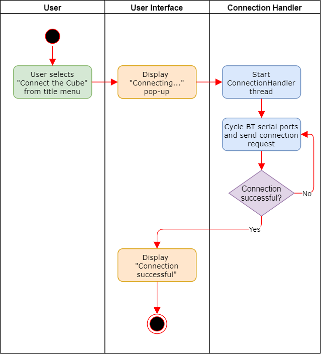
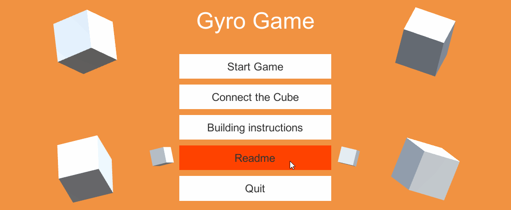

# GyroGame <!-- omit in toc -->

# Use-Case Specification: Connect Controller Cube <!-- omit in toc -->

## Table of Contents <!-- omit in toc -->
- [Connect Controller Cube](#connect-controller-cube)
  - [1.1 Brief Description](#11-brief-description)
- [2. Flow of Events](#2-flow-of-events)
  - [2.1 Basic Flow](#21-basic-flow)
    - [2.1.1 Activity Diagram](#211-activity-diagram)
    - [2.1.2 Mock Up](#212-mock-up)
- [3. Special Requirements](#3-special-requirements)
- [4. Preconditions](#4-preconditions)
- [4.1 Title menu visible](#41-title-menu-visible)
- [4.2 Cube powered on](#42-cube-powered-on)
- [5. Postconditions](#5-postconditions)
  - [5.1 Cube connected](#51-cube-connected)
- [5.2 Button changes label](#52-button-changes-label)
- [6. Extension Points](#6-extension-points)

## Connect Controller Cube

### 1.1 Brief Description
As a requirement every player has to be able to connect the control cube to the game instance.

The title menu includes a button for this function.
## 2. Flow of Events

### 2.1 Basic Flow

#### 2.1.1 Activity Diagram

#### 2.1.2 Mock Up

## 3. Special Requirements

(n/a)

## 4. Preconditions

## 4.1 Title menu visible
The title menu has to be currently visible.

## 4.2 Cube powered on
The cube has to be powered on and in pairing mode.

## 5. Postconditions

### 5.1 Cube connected
The cube is now marked as connected in the system.

## 5.2 Button changes label
The connection button now shows "Disconnect Cube".

## 6. Extension Points

(n/a)