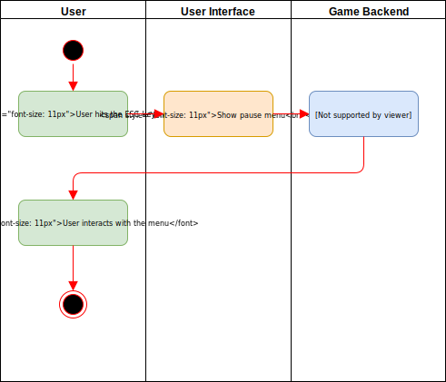
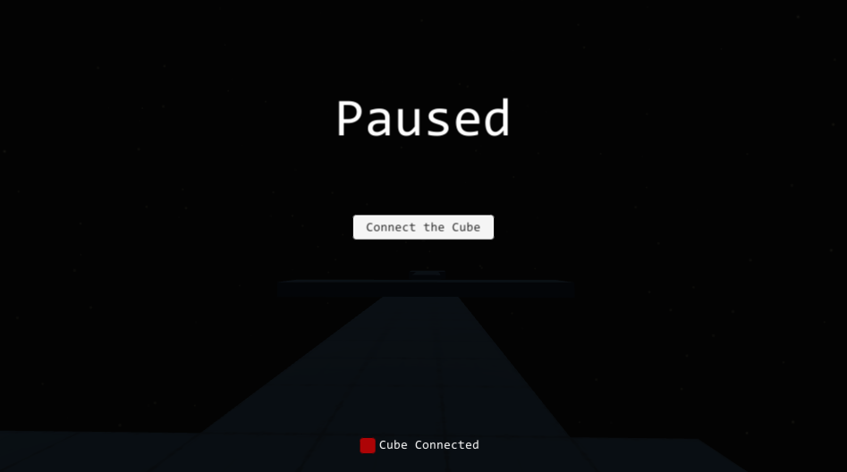

# GyroGame <!-- omit in toc -->

# Use-Case Specification: Pause Menu <!-- omit in toc -->

## Table of Contents <!-- omit in toc -->
- [Pause Menu](#pause-menu)
  - [1.1 Brief Description](#11-brief-description)
- [2. Flow of Events](#2-flow-of-events)
  - [2.1 Basic Flow](#21-basic-flow)
    - [2.1.1 Activity Diagram](#211-activity-diagram)
    - [2.1.2 Mock Up](#212-mock-up)
- [3. Special Requirements](#3-special-requirements)
- [4. Preconditions](#4-preconditions)
  - [4.1 Level active](#41-level-active)
- [5. Postconditions](#5-postconditions)
  - [5.1 Pause Menu visible](#51-pause-menu-visible)
- [6. Extension Points](#6-extension-points)

## Pause Menu

### 1.1 Brief Description
During a level, the player can pause the game at any time and enter the pause menu using the Escape key.

## 2. Flow of Events

### 2.1 Basic Flow

#### 2.1.1 Activity Diagram

#### 2.1.2 Mock Up

## 3. Special Requirements
(n/a)

## 4. Preconditions

### 4.1 Level active
A level has to be loaded and active.

## 5. Postconditions

### 5.1 Pause Menu visible
The pause menu is shown and the user can interact with it.

## 6. Extension Points
(n/a)