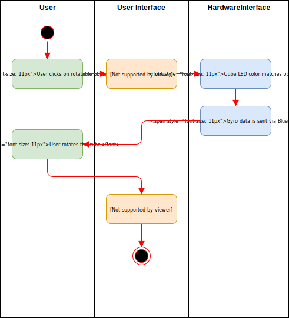
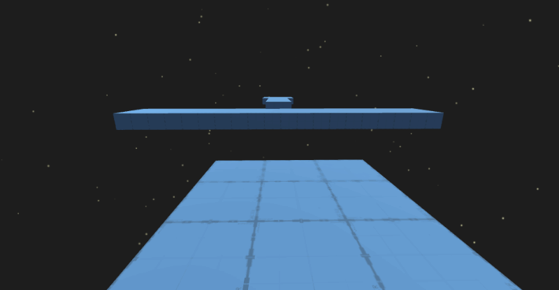

# GyroGame <!-- omit in toc -->

# Use-Case Specification: Rotate Obstacle <!-- omit in toc -->

## Table of Contents <!-- omit in toc -->
- [Cube Communication](#cube-communication)
  - [1.1 Brief Description](#11-brief-description)
- [2. Flow of Events](#2-flow-of-events)
  - [2.1 Basic Flow](#21-basic-flow)
    - [2.1.1 Activity Diagram](#211-activity-diagram)
    - [2.1.2 Mock Up](#212-mock-up)
- [3. Special Requirements](#3-special-requirements)
- [4. Preconditions](#4-preconditions)
- [4.1 Cube Connected](#41-cube-connected)
- [5. Postconditions](#5-postconditions)
  - [5.1 Execute command in cube firmware](#51-execute-command-in-cube-firmware)
- [6. Extension Points](#6-extension-points)

## Rotate Obstacle

### 1.1 Brief Description
When the player clicks aims at a rotatable obstacle and clicks on it, he will be able to rotate it using the controller cube.

## 2. Flow of Events

### 2.1 Basic Flow

#### 2.1.1 Activity Diagram

#### 2.1.2 Mock Up

## 3. Special Requirements
(n/a)

## 4. Preconditions

## 4.1 Cube Connected
The Cube has to be powered on and connected to the game.

## 4.2 Obstacle active
The obstacle has to be activated by the player with a mouse click.

## 5. Postconditions

### 5.1 Rotation
The obstacles rotation now matches the cube's rotation.

## 6. Extension Points
(n/a)